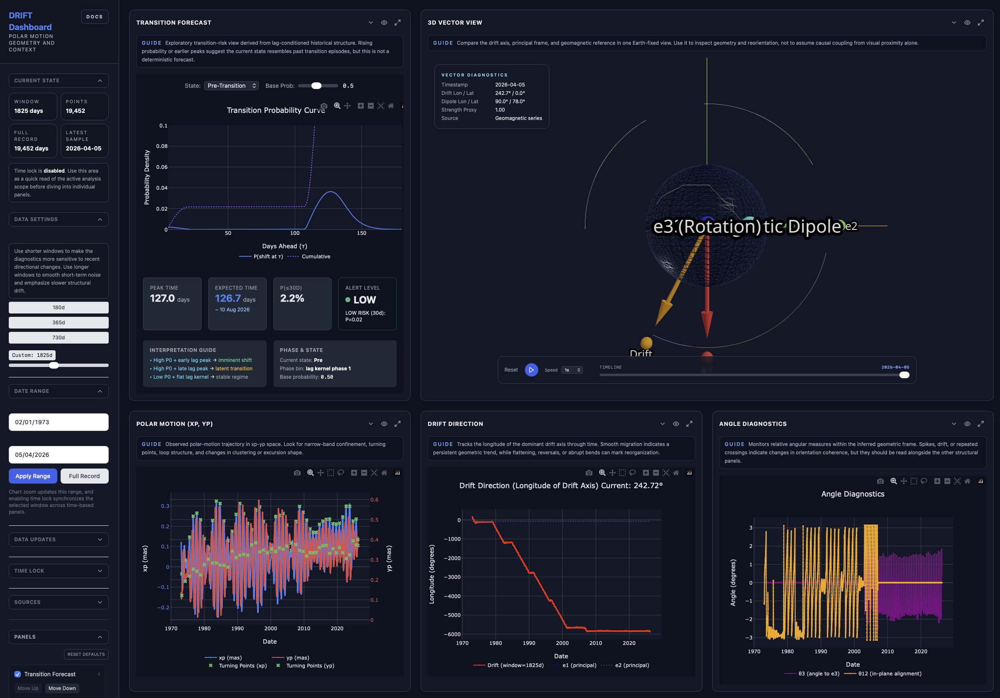

# DRIFT Dashboard

Constraint-first polar-motion diagnostics dashboard with geomagnetic context

Source paper: [Planar Structure and Regime Dynamics in Modern Polar Motion](https://www.academia.edu/165468224/Planar_Structure_and_Regime_Dynamics_in_Modern_Polar_Motion)



## Scientific Basis

The dashboard is built around the source paper [Planar Structure and Regime Dynamics in Modern Polar Motion](https://www.academia.edu/165468224/Planar_Structure_and_Regime_Dynamics_in_Modern_Polar_Motion), which analyzes polar motion with a constraint-first method: start from the geometric structure required by the observations, then interpret cautiously.

The paper's strongest claims are:

- polar motion is confined to a low-dimensional, near-planar structure over the observed interval
- projection onto the dominant axis reveals a robust two-state or bistable organization
- residual phase space shows coupled fast-slow behavior: looping motion embedded in a slower drifting structure

The paper is also explicit about what is weaker:

- absolute directional anisotropy and apparent axis stability are not statistically decisive against correlated-noise null models
- conclusions apply to the observed record, not necessarily to all times outside that window
- comparative geomagnetic context may be suggestive, but it is not by itself proof of a causal coupling

This repository should therefore be read as a geometry-first monitoring tool. The geomagnetic panels are comparison layers, and the transition forecast is an exploratory risk summary derived from the dashboard's lag-conditioned state model rather than a deterministic prediction engine.

## Quick Start

```bash
# Install dependencies
npm install

# Generate sample data
python scripts/build_inertia.py
python scripts/build_eop.py  
python scripts/build_geomag.py

# Run development server
npm run dev

# Open http://localhost:3000
```

## Docker Deployment

Build the production image:

```bash
docker build -t drift-dashboard:latest .
```

Run it locally or on a Kamatera host:

```bash
docker run -d \
  --name drift-dashboard \
  -p 3000:3000 \
  --restart unless-stopped \
  drift-dashboard:latest
```

Notes:

- The container serves the Next.js app on port `3000`.
- Python runtime dependencies are bundled because `/api/rolling-stats` computes diagnostics on demand.
- The image includes the current `data/`, `public/data/`, and `scripts/` directories needed by the dashboard.
- For Kamatera, point your reverse proxy or firewall rule at the VM’s port `3000`.

## Production Hosting

The live deployment is designed around a single Kamatera Linux VM:

- public app URL: `https://drift.nobulart.com`
- app container port: `3000`
- edge web server: `nginx`
- TLS: Let's Encrypt via `certbot`

### Architecture

```text
Internet
  -> nginx on ports 80/443
  -> reverse proxy to 127.0.0.1:3000
  -> Docker container running the Next.js standalone server
```

### Rebuild And Publish

Build and publish the production image for the Kamatera host architecture:

```bash
docker buildx build \
  --platform linux/amd64 \
  -t sunbear73/drift-dashboard:latest \
  --push .
```

### First-Time Server Setup

Install Docker:

```bash
apt-get update
apt-get install -y docker.io
systemctl enable --now docker
```

Install the reverse proxy and TLS tooling:

```bash
apt-get install -y nginx certbot python3-certbot-nginx
systemctl enable --now nginx
```

### Run Or Update The App Container

Pull the latest image and replace the running container:

```bash
docker pull sunbear73/drift-dashboard:latest
docker rm -f drift-dashboard || true
docker run -d \
  --name drift-dashboard \
  --restart unless-stopped \
  -p 3000:3000 \
  sunbear73/drift-dashboard:latest
```

Verify locally on the server:

```bash
docker ps
docker logs --tail=100 drift-dashboard
curl -I http://127.0.0.1:3000
```

### Nginx Configuration

Create `/etc/nginx/sites-available/drift.nobulart.com`:

```nginx
server {
    listen 80;
    listen [::]:80;
    server_name drift.nobulart.com;

    location / {
        proxy_pass http://127.0.0.1:3000;
        proxy_http_version 1.1;
        proxy_set_header Host $host;
        proxy_set_header X-Forwarded-For $proxy_add_x_forwarded_for;
        proxy_set_header X-Forwarded-Proto $scheme;
        proxy_set_header Upgrade $http_upgrade;
        proxy_set_header Connection "upgrade";
        proxy_read_timeout 300;
    }
}
```

Enable the site:

```bash
ln -sf /etc/nginx/sites-available/drift.nobulart.com /etc/nginx/sites-enabled/drift.nobulart.com
rm -f /etc/nginx/sites-enabled/default
nginx -t
systemctl reload nginx
```

### TLS Issuance

After the DNS `A` record for `drift.nobulart.com` points to the server public IP, issue the certificate:

```bash
certbot --nginx -d drift.nobulart.com --redirect
```

Useful checks:

```bash
dig +short drift.nobulart.com
curl -I http://drift.nobulart.com
curl -I https://drift.nobulart.com
certbot certificates
```

### Routine Redeploy

For subsequent updates, the deployment cycle is:

1. `npm run build`
2. `docker buildx build --platform linux/amd64 -t sunbear73/drift-dashboard:latest --push .`
3. SSH to the Kamatera host
4. `docker pull sunbear73/drift-dashboard:latest`
5. `docker rm -f drift-dashboard || true`
6. `docker run -d --name drift-dashboard --restart unless-stopped -p 3000:3000 sunbear73/drift-dashboard:latest`
7. Verify `https://drift.nobulart.com`

### Kamatera Staging Checklist

Use this exact sequence when staging a new build to the live Kamatera VM.

1. Confirm the working tree is clean enough to release:

```bash
git status --short --branch
npm run lint
npx tsc --noEmit
npm run build
```

2. Push the release commit to GitHub:

```bash
git push origin main
```

3. Build and publish the Linux image used by Kamatera:

```bash
docker buildx build \
  --platform linux/amd64 \
  -t sunbear73/drift-dashboard:latest \
  --push .
```

4. SSH to the Kamatera VM as `root` and confirm the currently running container:

```bash
ssh root@drift.nobulart.com
docker ps --format 'table {{.Names}}\t{{.Image}}\t{{.Status}}'
```

5. Pull the freshly published image and replace the container:

```bash
docker pull sunbear73/drift-dashboard:latest
docker rm -f drift-dashboard || true
docker run -d \
  --name drift-dashboard \
  --restart unless-stopped \
  -p 3000:3000 \
  sunbear73/drift-dashboard:latest
```

6. Verify on the VM before checking the public URL:

```bash
docker ps --format 'table {{.Names}}\t{{.Image}}\t{{.Status}}'
docker logs --tail=100 drift-dashboard
curl -I http://127.0.0.1:3000
```

7. Verify the public deployment and the visible version from another shell:

```bash
curl -I https://drift.nobulart.com
curl -s https://drift.nobulart.com/docs | rg 'Version v'
```

8. If the public site still appears stale in a browser, hard-refresh first. If the curl checks still show the old version, the Kamatera container was not actually refreshed and steps 4-7 should be repeated.

### Notes From Recent Deploys

- A successful image push does not mean Kamatera is updated. The VM must still `docker pull` and restart `drift-dashboard`.
- The most reliable user-visible version check is currently the docs badge at `/docs`.
- If SSH by hostname fails, use the current VM address from the Kamatera console rather than hard-coding server IPs or credentials into the repo.

## Project Structure

```
drift/
├── app/                 # Next.js App Router pages
├── components/          # React components
│   ├── Controls.tsx     # UI controls
│   ├── PolarPlot.tsx    # Polar motion visualization
│   ├── DriftDirectionPlot.tsx  # Drift direction plot (PRIMARY)
│   ├── AngleDiagnostics.tsx    # θ3 and θ12 diagnostics
│   ├── CouplingPlot.tsx        # Alignment vs geomagnetic activity
│   └── SphereView.tsx          # 3D frame visualization
├── lib/                 # Core libraries
│   ├── math.ts          # Vec3 operations
│   ├── transforms.ts    # Frame transformation utilities
│   ├── drift.ts         # PCA-based drift extraction
│   ├── nullModel.ts     # Synthetic polar motion generator
│   ├── parsing.ts       # Data parsing utilities
│   └── types.ts         # Shared type definitions
├── store/               # Zustand state management
├── scripts/             # Data pipeline scripts
├── public/data/         # Preprocessed data files
└── api/                 # Next.js API routes
```

## Features

1. **Polar Motion Visualization** - Plot xp/yp from IERS and inspect confinement, loops, and turning points
2. **Drift Direction** - Track the dominant axis implied by the local geometry
3. **Phase Diagnostics** - Read looping structure, angular velocity, and intermittency in phase space
4. **Angle and Deviation Metrics** - Compare orientation measures and local anisotropy
5. **Geomagnetic Context** - Compare dashboard geometry with Kp/ap and related context without assuming causation
6. **Transition Forecast** - Surface transition-like episodes using lag-conditioned historical structure

## Data Pipeline

### Precomputed (offline, Python)
- `scripts/build_inertia.py` - Process GRACE ℓ=2 to eigenframe JSON
- `scripts/build_eop.py` - Parse IERS EOP data
- `scripts/build_geomag.py` - Combine Kp/Dst/aa indices

### Live API (Next.js)
- `/api/eop` - Fetch latest IERS rapid data
- `/api/geomag` - Fetch NOAA indices
- `/api/combined` - Merge static + live data

## Math Overview

- **Drift Axis**: PCA on sliding window of polar motion
- **θ3**: Angle between drift and e3 (out-of-plane tilt)
- **θ12**: In-plane alignment angle to e1
- **Phase Portrait**: Fast cyclic structure in `(theta, omega)` state space
- **Orthogonal Deviation Ratio**: Local elongation versus isotropy of the inferred structure

## Reading Guidance

Use the dashboard in this order when you want the most paper-aligned interpretation:

1. Start with `Polar Motion`, `Drift Direction`, and `R(t)` to assess the geometry itself.
2. Use `Phase Portrait` and `Phase Diagnostics` to inspect fast-slow organization and intermittent behavior.
3. Check the 3D and geomagnetic panels for timing context and comparative alignment.
4. Read `Transition Forecast` as an exploratory summary of whether the current state resembles prior transition-like behavior.

If a conclusion depends mainly on alignment with geomagnetic panels or on a single forecast peak, it is weaker than a conclusion supported by the geometric panels together.

## Tech Stack

- **Next.js 14+** (App Router)
- **TypeScript** (strict mode)
- **Plotly.js** for charts
- **Three.js** (react-three-fiber) for 3D
- **Zustand** for state
- **Tailwind** for styling
