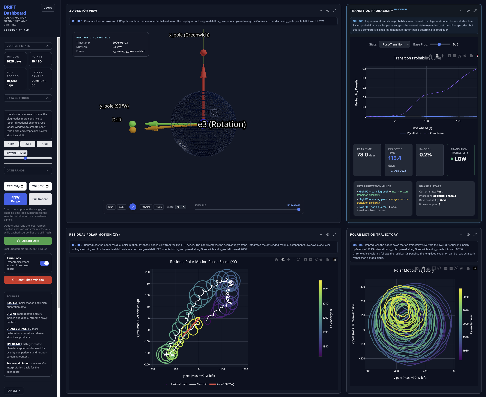

# DRIFT Dashboard

Constraint-first polar-motion diagnostics dashboard for geometry, phase structure, and experimental transition-probability diagnostics

Source paper: [Earth-Fixed Geometric Structure, Bistable Dynamics, and Phase-Locked Planetary Torque Coupling in Polar Motion](https://www.academia.edu/165465085/Earth_Fixed_Geometric_Structure_Bistable_Dynamics_and_Phase_Locked_Planetary_Torque_Coupling_in_Polar_Motion)



Current release: `v1.6.1`

## Release Notes

### v1.6.1

- Added the PHASE STABILITY diagnostic layer for θ-ω manifold departure, phase-conditioned Zω, curvature, hysteresis, historical analogue similarity, and the Coupling Stability Index.
- Added θ-conditioned historical corridor controls to the Phase Portrait and new phase-stability overlay series.
- Added Manifold Context to the Phase-Locked Escape Model so escape-energy diagnostics can be compared with off-manifold motion.
- Removed hardcoded TLS domains from the Docker image and startup defaults. Set `DRIFT_TLS_DOMAINS` explicitly when automatic HTTPS should run.

### v1.6.0

- Added API key authentication for high-cost and mutating API routes to protect the public instance from abusive usage.
- Protected `/api/combined-full`, `/api/ephemeris`, `/api/rolling-stats`, `/api/phase-escape`, and `/api/update-data` when `DRIFT_API_KEY` or `DRIFT_API_KEYS` is configured.
- Documented the accepted `Authorization: Bearer <key>` and `X-API-Key: <key>` request headers in the README, data-system notes, and in-app API documentation.
- Preserved unauthenticated local development behavior when no API key environment variable is configured.

### v1.5.9

- Seed first-time visitors with the curated default marker set from `data/markers.json`.
- Added the read-only `/api/markers` route used by the marker DEFAULT control.
- Routed both DEFAULT and LOAD marker imports through the same merge, replace, or cancel confirmation modal.

### v1.5.8

- Added a Greyscale gradient to the shared heatmap palette selector.
- Added the same palette selector to the Residual Polar Motion (XY) phase-space and Polar Motion Trajectory panels.
- Persisted overlay and path palette choices across sessions, with Reset Defaults restoring the path palettes to Viridis and the overlay to Line Chart.

### v1.5.7

- Added sidebar-managed emoji chart markers with the penguin marker as the default.
- Persisted markers across sessions until dashboard defaults are reset.
- Synchronized marker dates across timeline plots and added right-click deletion near existing markers.
- Added icon-only markers to the Phase Portrait, Residual Polar Motion (XY), and Polar Motion Trajectory path charts.
- Added marker editing controls to fullscreen chart popups.

### v1.5.6

- Increased the Overlay Plot vertical display area by 10% in normal and fullscreen panel modes.
- Added a Plot selector beside the core overlay data selectors with Line Chart plus scientific heatmap palette modes.
- Added heatmap comparison rows for all selected overlay signals, including DE442 ephemeris selections aligned by date.
- Reset Plotly chart state when switching between line and heatmap modes to avoid stale axis and trace artifacts.
- Switched heatmap palettes to explicit scientific color stops so Viridis, Plasma, Magma, Inferno, Turbo, Spectral, and related modes render distinctly.

### v1.5.5

- Optimized the DRIFT data and UI pipelines after profiling the route, JSON, and Python analysis hot paths.
- Added yearly ephemeris shards and shard-aware ephemeris/phase-escape reads, reducing one-year ephemeris range requests from roughly 580 ms to tens of milliseconds.
- Reworked rolling diagnostics with prefix-sum covariance windows, reducing cold rolling-stat computation from roughly 4.7 s to 2.3 s locally.
- Added route projections for conditional lag and phase-escape panels, cutting conditional-lag panel payloads from about 6.05 MB to 66 KB and phase-escape panel payloads from about 14.5 MB to 3.16 MB.
- Added in-flight compute deduping, client-side stale request cancellation, parsed JSON reuse for stable pipeline files, and compact JSON writes for derived artifacts.
- Documented the benchmark comparison in `PERFORMANCE_REVIEW.md`.

### v1.5.4

- Added JPL EOP2 as a selectable EOP backend using `latest_eop2.long` plus the observed short-tail updates.
- Converted JPL PMx/PMy milliarcsecond values into the dashboard's arcsecond `xp`/`yp` contract and excluded prediction rows beyond the last observed UTPM datum.
- Added generated JPL EOP2 JSON caches and documented `dataset=jpl` for `/api/eop`.
- Added JPL EOP2 to the sidebar and inline docs source lists.

### v1.5.3

- Added cache-wide temporal normalization for the Net torque proxy so each non-Sun/non-Moon body contributes by timing rather than absolute intensity.
- Refreshed ephemeris cache merge/API behavior so older records gain `bodies.net` and missing Net rows are treated as stale.
- Bounded overlay ephemeris loading to the active observation or time-lock window while preserving the 1900-2100 display context.
- Updated dashboard, API, and data-system documentation for the temporal-normalized Net torque objective.

### v1.5.2

- Added a Data Settings selector for alternate IERS EOP backfills.
- Supported EOP products are `finals.all (IAU1980)`, `finals.all (IAU2000)`, and `EOP 20u24 C04 (IAU2000A)`.
- Routed the selected EOP dataset through dashboard loading, rolling statistics, conditional lag, transition probability, and phase-escape diagnostics.
- Added generated JSON caches for the IAU2000 finals.all and EOP 20u24 C04 products.

### v1.5.1

- Added the Loop-Center Angular Velocity panel, reproducing the paper diagnostic from the live EOP store instead of a static figure.
- Preserved the paper-equivalent completed-loop smoothing while showing the newest incomplete-loop estimate as a separate provisional endpoint.
- Labeled low-radius provisional centers as low-confidence and added a visible endpoint error bar that combines robust residual spread with near-origin angular sensitivity.
- Added dashboard/docs guidance for interpreting provisional loop-center angular velocity without over-reading endpoint instability.

### v1.5.0

- Added confirmed turning-point markers to the Polar Motion Trajectory and Residual Polar Motion (XY) path views.
- Filtered unconfirmed boundary turning-point regions so the newest sample is not marked before the low-omega episode is bracketed by future data.
- Increased horizontal legend spacing in the Conditional Lag Response phase-bin slice plot.
- Updated internal docs with reordered experimental panel guides and a companion Phase-Locked Escape Model detail panel.

### v1.4.9

- Fixed adaptive turning-point detection so the default threshold no longer collapses the full omega history into one turning region.
- Reworked the conditional lag response anchors so all selected states can populate from contiguous state episodes, with sample-count metadata exposed to the transition panel.
- Updated transition probability to use the computed lag kernel, preserve base probability in cumulative probabilities, and report `P(≤30d)` against the actual 30-day lag.
- Fixed `R(t)` tail computation so the latest samples use trailing windows instead of being forward-filled from the last pre-padding value.
- Added rolling-stats cache invalidation for model-code changes so derived outputs refresh when the Python computation changes.

### v1.4.8

- Added the Residual Polar Motion (XY) panel and Polar Motion Trajectory panel, both with square plot geometry and chronological path coloring.
- Standardized the polar-motion displays against the IERS EOP convention: `x_pole` is shown north/up along the Greenwich meridian and `y_pole` is shown west/left toward 90°W.
- Aligned the 3D Vector View with the same frame, including unambiguous vector labels, drift longitude in E/W notation, and clearer label placement.
- Enlarged and corrected square fullscreen modals so the residual, trajectory, and 3D views can use the available browser window efficiently.

### v1.4.7

- Added the Phase-Locked Escape Model as the first full-width dashboard panel, using internal DRIFT state plus DE442-derived phase composites rather than exploratory CSV exports.
- Added phase drift, local linear time-to-alignment, oscillatory regime detection, phase acceleration, curvature signal, and phase stability diagnostics.
- Added the escape-energy diagnostic: phase kinetic energy, phase potential energy, total phase energy, barrier ratio, energy-state classification, and a Kramers-like comparative index using `R(t)` as a noise proxy.
- Added energy overlays and optional time-series traces for phase potential energy, total phase energy, and barrier ratio.

### v1.4.6

- Added a sidebar-driven Update Data workflow that runs `scripts/fetch_latest.py` through a local API route, with spinner feedback and post-update dashboard reload.
- Added timestamp-aware freshness checks to `scripts/fetch_latest.py` so EOP, GFZ-KP, GRACE, and combined outputs are skipped while local files are still fresh; use `--force` for a full manual refresh.
- Reworked panel fullscreen behavior so the existing panel instance expands in place, preserving selected traces, ranges, controls, and guide/info content across panel and fullscreen views.

### v1.4.5

- Removed synthetic GRACE, inertia, and fallback geomagnetic-axis data from the ingestion and retrieval pipeline so the dashboard now serves real inputs only.
- Corrected the phase portrait and phase-diagnostics handling around phase-wrap artifacts to avoid spurious branch-cut spikes in the displayed loop geometry.
- Temporarily disabled the Angle Diagnostics and Alignment panels in the UI while their real-data-only replacements are being reworked.

### v1.4.4

- Added date information to the Phase Portrait hover popup so users can identify when specific phase-space features, loops, and turning points occurred.

### v1.4.3

- Added a highlighted present-state marker and recent trajectory overlay to the Phase Portrait, now focused on the last 180 days.
- Enlarged fullscreen popup charts to use roughly 85% of browser width and a taller plotting area, with responsive plot resizing inside the modal.
- Added shared fullscreen-aware plot sizing so expanded charts across the dashboard actually use the larger popup dimensions.

### v1.4.2

- Moved stale-data checking and conditional pipeline execution to server startup so the dashboard only launches after required data are current.
- Fixed Transition Probability plot redraw and rescaling when State or Base Prob changes.
- Compacted the sidebar layout, restored clean stacking between Sources and Panels, and improved sidebar scrolling on medium-height displays.

### v1.4.1

- Corrected the Transition Probability expected-date label so it now adds the probability horizon to the actual current date rather than the cached data timestamp.

### v1.4.0

- Added start, back, forward, and finish controls to the 3D Vector View timeline for direct frame stepping.
- Reworked 3D playback timing to use elapsed time rather than rounded interval steps, improving low-speed behavior and realtime smoothness.
- Anchored Transition Probability expected dates to the latest available sample so 3D timeline scrubbing no longer shifts the probability horizon.
- Replaced the plain startup loading text with a centered animated progress widget for a cleaner initial launch experience.

### v1.3.0

- Added DE442-backed Earth-geocentric overlay signals for all tracked bodies.
- Added a slim daily ephemeris cache covering `1973-01-02` through `2050-12-31`.
- Added overlay-selectable distance, angular velocity, radial velocity, ecliptic longitude, and heuristic torque-proxy series.
- Added a derived Net torque overlay that sums non-Sun/non-Moon torque proxies after each body is normalized by its own cache-wide peak, emphasizing temporal alignment over absolute intensity.
- Removed hidden default ephemeris selections so an unchecked overlay plot is truly empty.

## Scientific Basis

The dashboard is built around the source paper [Earth-Fixed Geometric Structure, Bistable Dynamics, and Phase-Locked Planetary Torque Coupling in Polar Motion](https://www.academia.edu/165465085/Earth_Fixed_Geometric_Structure_Bistable_Dynamics_and_Phase_Locked_Planetary_Torque_Coupling_in_Polar_Motion), which analyzes polar motion with a constraint-first method: start from the geometric structure required by the observations, then interpret cautiously.

The paper's strongest claims are:

- polar motion is confined to a low-dimensional, near-planar structure over the observed interval
- projection onto the dominant axis reveals a robust two-state or bistable organization
- residual phase space shows coupled fast-slow behavior: looping motion embedded in a slower drifting structure

The paper is also explicit about what is weaker:

- absolute directional anisotropy and apparent axis stability are not statistically decisive against correlated-noise null models
- conclusions apply to the observed record, not necessarily to all times outside that window
- comparative geomagnetic context may be suggestive, but it is not by itself proof of a causal coupling

This repository should therefore be read as a geometry-first monitoring tool. The geomagnetic panels are comparison layers, and the Transition Probability and Phase-Locked Escape Model panels are explicitly experimental diagnostics derived from lag-conditioned and phase-conditioned state structure rather than deterministic prediction engines.

## Quick Start

```bash
# Install dependencies
npm install

# Refresh pipeline artifacts as needed; fresh local source files are skipped
python scripts/fetch_latest.py
python scripts/fetch_latest.py --force
python scripts/combine_data.py

# Run development server
npm run dev

# Open http://localhost:3000
```

## Docker Deployment

The project can be packaged as a standalone Docker image. The image runs the Next.js standalone server on port `3000`, bundles the Python runtime used by analysis API routes, and includes the checked-in `data/`, `public/data/`, and `scripts/` directories.

### Build Locally

Build a local development/test image:

```bash
docker build -t drift-dashboard:latest .
```

Run it locally:

```bash
docker run -d \
  --name drift-dashboard \
  -p 3000:3000 \
  --restart unless-stopped \
  drift-dashboard:latest
```

Verify:

```bash
docker ps --format 'table {{.Names}}\t{{.Image}}\t{{.Status}}'
docker logs --tail=100 drift-dashboard
curl -I http://127.0.0.1:3000
```

### Automatic HTTPS In Docker

The production Docker image includes nginx and Certbot. At startup it:

- starts the Next.js app on `PORT`, default `3000`
- starts nginx on ports `80` and `443` when the container is running as root
- checks the configured TLS domains against the instance public IP
- requests or renews a Let's Encrypt certificate only for domains whose `A` or `AAAA` records point at the instance
- keeps serving HTTP and the direct app port if DNS, networking, port mapping, or certificate issuance is not viable

There are no default TLS domains. Set `DRIFT_TLS_DOMAINS` explicitly when this container should request or renew certificates.

For automatic HTTPS on a VM, publish ports `80` and `443` as well as the direct app port:

```bash
docker run -d \
  --name drift-dashboard \
  --restart unless-stopped \
  -p 80:80 \
  -p 443:443 \
  -p 3000:3000 \
  -v drift-letsencrypt:/etc/letsencrypt \
  -v drift-certbot:/var/lib/letsencrypt \
  -e DRIFT_TLS_DOMAINS=example.com,www.example.com \
  -e DRIFT_TLS_EMAIL=admin@example.com \
  <registry>/<image>:<tag>
```

The named volumes preserve issued certificates and Certbot renewal state across container replacements.

Configuration:

```text
DRIFT_TLS_DOMAINS   Optional comma- or semicolon-separated domain list. Empty by default; set it to enable certificate requests.
DRIFT_TLS_EMAIL     Optional Let's Encrypt registration email. If unset, Certbot registers without email.
DRIFT_TLS_STAGING   Set to 1 to use Let's Encrypt staging while testing DNS and port mappings.
```

For managed platforms that terminate TLS before the container, no special configuration is needed. The DNS viability check will skip certificate issuance unless the configured domains point directly at the running instance.

### Build And Publish A Registry Image

Build and publish the Linux image used by external Docker hosts. Replace `<registry>/<image>:<tag>` with your registry path, for example `ghcr.io/<owner>/<image>:latest` or `docker.io/<user>/<image>:latest`.

```bash
docker buildx build \
  --platform linux/amd64 \
  -t <registry>/<image>:<tag> \
  --push .
```

Useful checks after publishing:

```bash
docker images --format '{{.Repository}}:{{.Tag}} {{.ID}} {{.CreatedSince}}' <image>
docker buildx imagetools inspect <registry>/<image>:<tag>
```

If `imagetools inspect` cannot resolve your registry because of a local DNS/network issue, rely on the completed `buildx --push` output and re-run the inspect command when network resolution returns.

## Production Hosting

DRIFT can be deployed on any host that can run a Node.js or Docker workload. Two common patterns are:

```text
Internet
  -> managed app platform
  -> app built from this repository or Dockerfile
```

```text
Internet
  -> reverse proxy on ports 80/443
  -> Docker container on 127.0.0.1:3000
```

For routine production releases, push the release commit and verify the deployed site:

```bash
git status --short --branch
npm run build
git push origin main
curl -I https://<your-domain.example>
curl -s https://<your-domain.example>/docs | rg 'Version v'
```

The docs badge at `/docs` is the most reliable user-visible version check.

### Managed App Platform

Use your platform's Dockerfile or Node.js build flow. Most managed app platforms can either build this repository directly or consume a published Docker image from a registry.

The exact deployment trigger, environment variables, domain setup, and cache behavior are provider-specific. After a deployment, verify the site and the visible version badge:

```bash
curl -I https://<your-domain.example>
curl -s https://<your-domain.example>/docs | rg 'Version v'
```

### Manual VM Deployment

These instructions are for a Linux VM deployment of the published Docker image.

Target shape:

```text
Internet
  -> reverse proxy on ports 80/443
  -> reverse proxy to 127.0.0.1:3000
  -> Docker container running <registry>/<image>:<tag>
```

Install Docker on the VM:

```bash
apt-get update
apt-get install -y docker.io
systemctl enable --now docker
```

Install a reverse proxy and TLS tooling. For nginx with Certbot:

```bash
apt-get install -y nginx certbot python3-certbot-nginx
systemctl enable --now nginx
```

Pull the latest image and replace the running container:

```bash
docker pull <registry>/<image>:<tag>
docker rm -f drift-dashboard || true
docker run -d \
  --name drift-dashboard \
  --restart unless-stopped \
  -p 3000:3000 \
  <registry>/<image>:<tag>
```

Verify locally on the server:

```bash
docker ps
docker logs --tail=100 drift-dashboard
curl -I http://127.0.0.1:3000
```

Create a reverse-proxy config for your domain. For nginx, create `/etc/nginx/sites-available/<your-domain.example>`:

```nginx
server {
    listen 80;
    listen [::]:80;
    server_name <your-domain.example>;

    location / {
        proxy_pass http://127.0.0.1:3000;
        proxy_http_version 1.1;
        proxy_set_header Host $host;
        proxy_set_header X-Forwarded-For $proxy_add_x_forwarded_for;
        proxy_set_header X-Forwarded-Proto $scheme;
        proxy_set_header Upgrade $http_upgrade;
        proxy_set_header Connection "upgrade";
        proxy_read_timeout 300;
    }
}
```

Enable the site:

```bash
ln -sf /etc/nginx/sites-available/<your-domain.example> /etc/nginx/sites-enabled/<your-domain.example>
rm -f /etc/nginx/sites-enabled/default
nginx -t
systemctl reload nginx
```

After the DNS `A` or `AAAA` record for your domain points to the server public IP, issue the certificate:

```bash
certbot --nginx -d <your-domain.example> --redirect
```

Useful checks:

```bash
dig +short <your-domain.example>
curl -I http://<your-domain.example>
curl -I https://<your-domain.example>
certbot certificates
```

If SSH to your host reports `REMOTE HOST IDENTIFICATION HAS CHANGED`, stop and verify that you are connecting to the intended server before changing `~/.ssh/known_hosts`.

### Release Checklist

Use this sequence when staging a new release.

1. Confirm the working tree is clean enough:

```bash
git status --short --branch
npm run lint
npx tsc --noEmit
npm run build
```

2. Commit and push the release:

```bash
git push origin main
```

3. Build and publish the Docker image artifact:

```bash
docker buildx build \
  --platform linux/amd64 \
  -t <registry>/<image>:<tag> \
  --push .
```

4. Verify the public deployment and visible version:

```bash
curl -I https://<your-domain.example>
curl -s https://<your-domain.example>/docs | rg 'Version v'
```

5. If the public site still appears stale in a browser, hard-refresh first. If `curl` still shows the old version, check your hosting provider's deployment status for the pushed commit or image.

### Notes From Recent Deploys

- A successful Docker image push does not by itself update a managed app host unless that host is configured to consume the pushed image.
- The most reliable user-visible version check is the docs badge at `/docs`.
- Keep domain names, registry namespaces, server IPs, and credentials in your hosting provider or local environment rather than hard-coding them into the repository.

## Project Structure

```
drift/
├── app/                 # Next.js App Router pages
├── components/          # React components
│   ├── Controls.tsx     # UI controls
│   ├── PolarPlot.tsx    # Polar motion visualization
│   ├── DriftDirectionPlot.tsx  # Drift direction plot (PRIMARY)
│   ├── TransitionForecastPanel.tsx  # Experimental lag-conditioned transition probability
│   └── SphereView.tsx          # 3D frame visualization
├── lib/                 # Core libraries
│   ├── math.ts          # Vec3 operations
│   ├── transforms.ts    # Frame transformation utilities
│   ├── drift.ts         # PCA-based drift extraction
│   ├── parsing.ts       # Data parsing utilities
│   └── types.ts         # Shared type definitions
├── store/               # Zustand state management
├── scripts/             # Data pipeline scripts
├── public/data/         # Preprocessed data files
└── api/                 # Next.js API routes
```

## Features

1. **Polar Motion Visualization** - Plot xp/yp from IERS and inspect confinement, loops, and turning points
2. **Drift Direction** - Track the dominant axis implied by the local geometry
3. **Phase Diagnostics** - Read looping structure, angular velocity, and intermittency in phase space
4. **Orthogonal Deviation and Lag Structure** - Compare local anisotropy, turning-point response, and conditional lag behavior
5. **Geomagnetic Context** - Compare dashboard geometry with Kp/ap and related context without assuming causation
6. **Transition Probability** - Surface transition-like similarity using lag-conditioned historical structure
7. **Planetary Overlay Context** - Compare drift and related signals against DE442-derived Earth-geocentric planetary observables
8. **Phase-Locked Escape Model** - Inspect phase-dependent escape probability, phase drift, curvature, escape-energy diagnostics, barrier ratio, and residual phase misalignment from internal DRIFT state plus DE442

## Data Pipeline

### Precomputed (offline, Python)
- `scripts/fetch_latest.py` - Refresh upstream source caches
- `scripts/combine_data.py` - Merge observed source products into dashboard-ready JSON
- `scripts/compute_rolling_stats.py` - Compute rolling diagnostics, lag models, and transition-probability inputs
- `scripts/build_ephemeris.py` - Extract slim DE442 overlay series into daily JSON cache
- `scripts/compute_phase_escape.py` - Build phase-escape state inputs from internal EOP and DE442 caches

### Live API (Next.js)

#### API authentication

High-cost API routes are public by default for local development. Set `DRIFT_API_KEY` to require authentication on the protected routes, or set `DRIFT_API_KEYS` to a comma-separated list for key rotation. Requests may authenticate with either `Authorization: Bearer <key>` or `X-API-Key: <key>`.

Protected routes: `/api/combined-full`, `/api/ephemeris`, `/api/rolling-stats`, `/api/phase-escape`, and `/api/update-data`.

#### `GET /api/eop`
- Returns cached historical Earth Orientation Parameters from the selected EOP product.
- Primary fields: `t`, `xp`, `yp`.
- Optional query parameter: `dataset`.
- Supported dataset ids:
  - `finals`: `finals.all (IAU1980)`, served from `eop_historic.json`; this is the default when `dataset` is omitted or unknown.
  - `finals2000a`: `finals.all (IAU2000)`, served from `eop_finals2000a_historic.json`.
  - `c04`: `EOP 20u24 C04 (IAU2000A)`, served from `eop_c04_historic.json`.
  - `jpl`: `JPL EOP2`, served from `eop_jpl_eop2_historic.json`.
- Examples: `/api/eop?dataset=finals2000a`, `/api/eop?dataset=c04`, `/api/eop?dataset=jpl`.
- Response header: `X-DRIFT-EOP-Dataset` contains the resolved dataset id.

#### `GET /api/inertia`
- Returns cached inertia-frame time series from `inertia_timeseries.json` when real upstream inputs are available.
- Primary fields: `t`, `e1`, `e2`, `e3`.

#### `GET /api/grace`
- Returns cached GRACE / GRACE-FO mass-context series from `grace_historic.json` when real upstream inputs are available.
- Primary fields: `t`, `lwe_mean`, `lwe_std`.

#### `GET /api/geomag`
- Returns normalized daily GFZ geomagnetic records derived from `geomag_gfz_kp.json`.
- Primary fields: `t`, `kp`, `ap`, `cp`, `c9`.

#### `GET /api/geomag-gfz`
- Returns the raw cached GFZ geomagnetic history from `geomag_gfz_kp.json`.
- Use this when you want the underlying cached series without the extra normalization wrapper used by `/api/geomag`.

#### `GET /api/combined`
- Returns a lightweight merged series combining EOP with any available real auxiliary fields where dates overlap.
- Primary fields: `t`, `xp`, `yp`, optional `grace_lwe_mean`, `grace_lwe_std`.

#### `GET /api/combined-full`
- Returns the full combined dashboard dataset from `combined_historic.json`.
- Primary fields include `t`, `xp`, `yp`, geomagnetic context, GRACE context, and inertia-frame vectors when available from real cached products.

#### `GET /api/ephemeris`
- Returns the cached DE442-derived Earth-geocentric overlay dataset.
- Current bundled cache window: `1962-01-01` through `2050-12-31`, matching the earliest selectable EOP product.
- Optional query parameters: `start=YYYY-MM-DD` and `end=YYYY-MM-DD`.
- When a requested range falls outside the local cache, or is covered by an older cache without `bodies.net`, the route runs `scripts/build_ephemeris.py --merge` to refresh or populate the dates before responding.
- Primary payload shape:
  `source` metadata plus `records[]`, where each record has `t` and `bodies`.
- Per-body overlay metrics currently exposed:
  `distance_au`, `angular_velocity_deg_per_day`, `radial_velocity_km_s`, `ecliptic_longitude_deg`, `torque_proxy`.
- `bodies.net.torque_proxy` is a temporal-comparison signal: non-Sun/non-Moon body torque proxies are each divided by their body-specific cache-wide peak before summing.

#### `GET /api/rolling-stats`
- Computes or serves cached rolling diagnostics from `compute_rolling_stats.py`.
- Supported query params:
  `windowSize`, `turnThreshold`, `centerWindow`, `centerStep`, `danceWindow`, `conditionalTargetState`.
- Returns rolling geometry and state outputs such as `theta`, `omega`, `rRatio`, `turningPoints`, `lagModel`, and `conditionalLagModel`.

#### `GET /api/transition-forecast`
- Converts the requested lag-conditioned state kernel into a forward transition probability curve.
- Supported query params:
  `currentState`, `theta`, `baseProb`, `smoothSigma`.
- Returns `lags`, `P_tau`, `expected_time`, `peak_time`, `cumulative`, `probability_level`, `probability_message`, and related probability-summary metadata.

#### `GET /api/phase-escape`
- Builds the Phase-Locked Escape Model inputs from the internal DRIFT EOP state and the cached DE442 ephemeris series.
- Computes solar-residual DRIFT phase, DE442 torque-proxy analytic phases, the registered planetary composites, and residual phase misalignment.
- Supports the panel's phase-drift, phase-acceleration, escape-energy, barrier-ratio, and Kramers-like comparative diagnostics in the frontend model layer.
- Does not depend on `docs/drift.csv` or any `docs/outputs` exploratory artifacts.

## Math Overview

- **Drift Axis**: PCA on sliding window of polar motion
- **θ3**: Angle between drift and e3 (out-of-plane tilt)
- **θ12**: In-plane alignment angle to e1
- **Phase Portrait**: Fast cyclic structure in `(theta, omega)` state space
- **Orthogonal Deviation Ratio**: Local elongation versus isotropy of the inferred structure

## Reading Guidance

Use the dashboard in this order when you want the most paper-aligned interpretation:

1. Start with `Polar Motion`, `Drift Direction`, and `R(t)` to assess the geometry itself.
2. Use `Phase Portrait` and `Phase Diagnostics` to inspect fast-slow organization and intermittent behavior.
3. Check the 3D panel, overlays, and any available geomagnetic context for timing comparison.
4. Use the `Phase-Locked Escape Model` (experimental) to inspect phase-conditioned escape probability, drift, curvature, barrier ratio, and comparative escape-energy diagnostics.
5. Read `Transition Probability` (experimental) as an exploratory summary of whether the current state resembles prior transition-like behavior.

If a conclusion depends mainly on geomagnetic coincidence or on a single transition-probability peak, it is weaker than a conclusion supported by the geometric panels together.

### Phase-Locked Escape Model

The Phase-Locked Escape Model panel uses the production DRIFT database/state and the internal DE442 ephemeris pipeline. `docs/drift.csv` was an exploratory analysis export only; the production panel does not read that CSV and does not require files from `docs/outputs` at runtime.

The model is an experimental phase-conditioned metastable escape diagnostic. It reports residual phase misalignment, phase-dependent escape probability, phase drift, local linear time-to-alignment, phase acceleration, curvature signal, phase stability, the current metastable phase-well state, and high-R escape modulation. It should not be read as deterministic planetary forcing or prediction certainty.

The escape-energy diagnostic treats residual phase motion as movement in a modulated phase potential. Kinetic energy is estimated from phase velocity, potential energy from angular offset relative to the preferred escape phase, and the barrier ratio normalizes the current phase-energy state against the empirical modulation barrier. The Kramers-like index uses `R(t)` as a noise proxy and should be interpreted as a comparative index rather than an absolute probability, physical-joule energy, or deterministic transition clock.

## Tech Stack

- **Next.js 14+** (App Router)
- **TypeScript** (strict mode)
- **Plotly.js** for charts
- **Three.js** (react-three-fiber) for 3D
- **Zustand** for state
- **Tailwind** for styling
